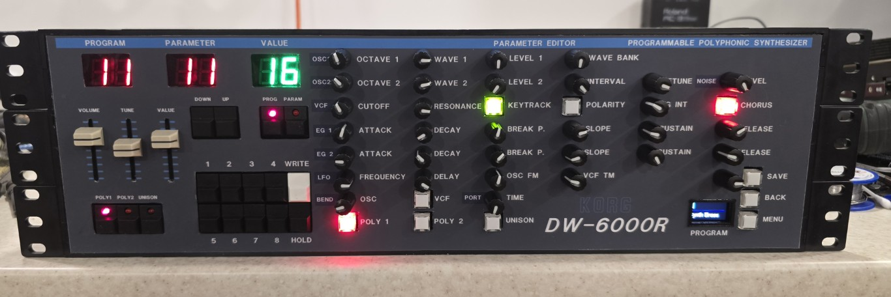

# Korg-DW6000-Editor-Encoders

This is an update to my original DW6000 Editor that used pots for the parameters. 

I have updated it to use encoders and control the boards of my DW6000 mounted in a 19" rack.

Temporary fix for wavebank selection from the encoder. 

Added afterTouch as an option in the settings so you can control the modulation via aftertouch.

